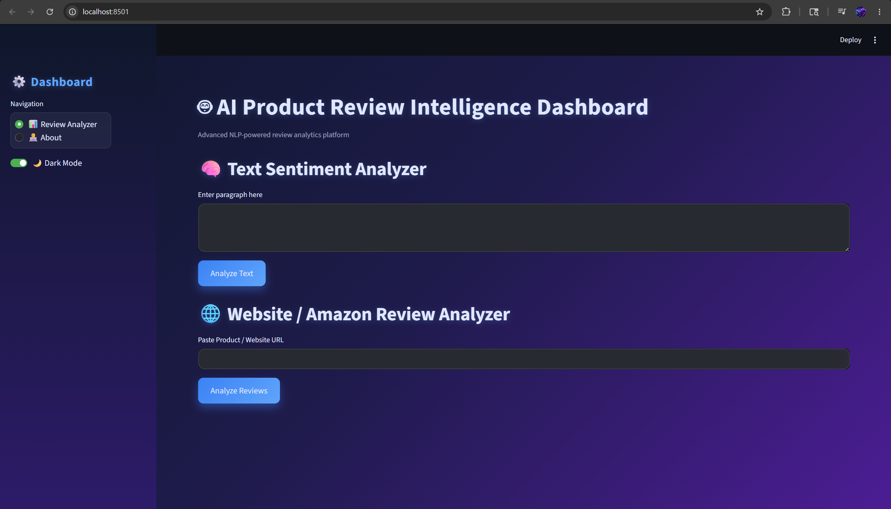
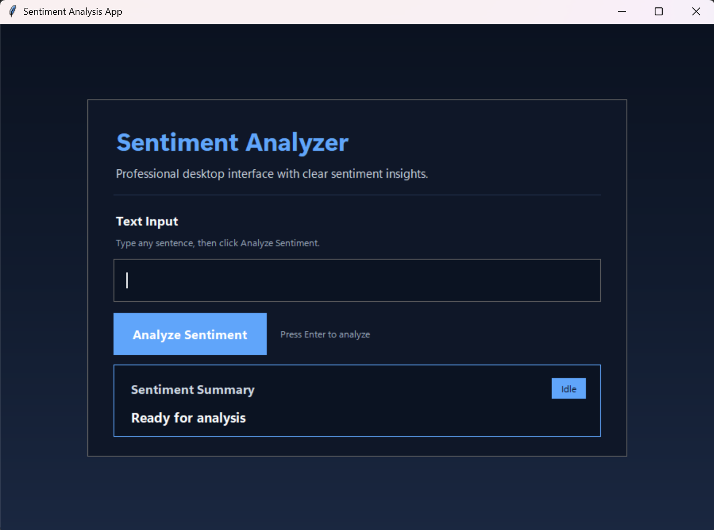

# Sentiment Analysis Web App

<p align="center">
  
</p>

<p align="center">
  A professional Python-based sentiment analysis project that classifies text as positive, negative, or neutral using NLTK VADER.
</p>

<p align="center">
  
  
  
  
</p>

## Overview

This repository contains two polished interfaces for sentiment analysis:

- A **Streamlit web application** for interactive review and text analysis
- A **Tkinter desktop application** for quick local sentiment checks

The project uses **NLTK VADER** for sentiment scoring and includes review collection, visualization, and lightweight NLP utilities.

## Highlights

- Real-time sentiment classification for user-entered text
- Review analysis for websites, Amazon pages, and Reddit threads
- Visual analytics with Plotly charts
- Clean Streamlit interface with dark/light mode support
- Desktop GUI version built with Tkinter

## Screenshots

### Web Application



### Desktop Application



## Requirements

Install the project dependencies listed in `requirements.txt`.

```bash
pip install -r requirements.txt
```

## Installation

1. Clone the repository:
   ```bash
   git clone https://github.com/yourusername/sentiment-analysis-webapp.git
   cd Sentiment-Analysis-WebApp
   ```
2. Install the dependencies:
   ```bash
   pip install -r requirements.txt
   ```

## Usage

### Streamlit Web Application

```bash
streamlit run web.py
```

### Tkinter Desktop Application

```bash
python app.py
```

## Project Structure

- `app.py` — Tkinter desktop sentiment analysis app
- `web_app.py` — Streamlit review and sentiment analysis dashboard
- `requirements.txt` — Python dependencies

## Technology Stack

- Python
- NLTK VADER
- Streamlit
- Tkinter
- Plotly
- Pandas
- Requests
- BeautifulSoup
- Selenium

## Customizing for a GitHub Profile

If you want to use this style on your GitHub profile README, update the placeholders below:

- Your name and short bio
- Your GitHub username in badge links
- Real screenshots in place of the placeholder images
- Social links, featured projects, and contact details

## License

Its free for Everyone to use and modify this project as needed. Please give credit to the original author if you use or adapt this code in your projects.
